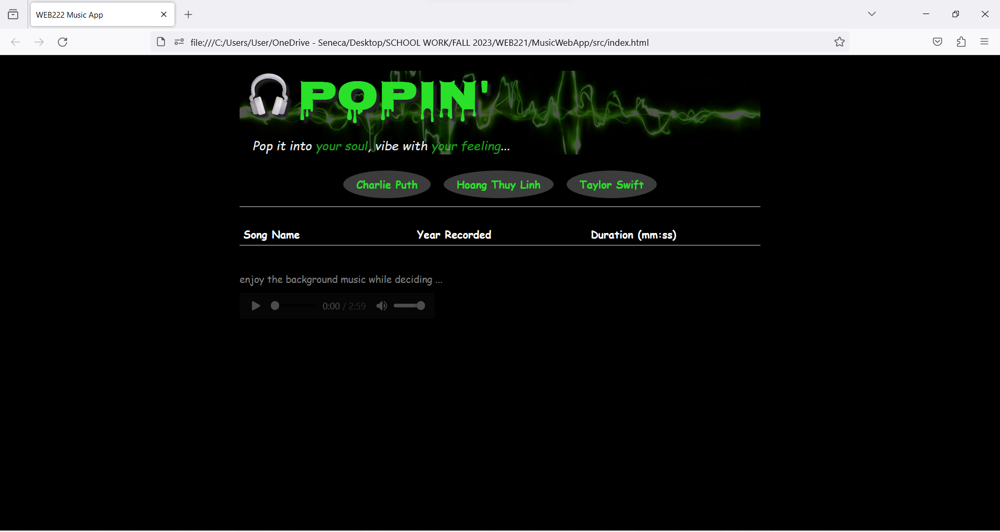
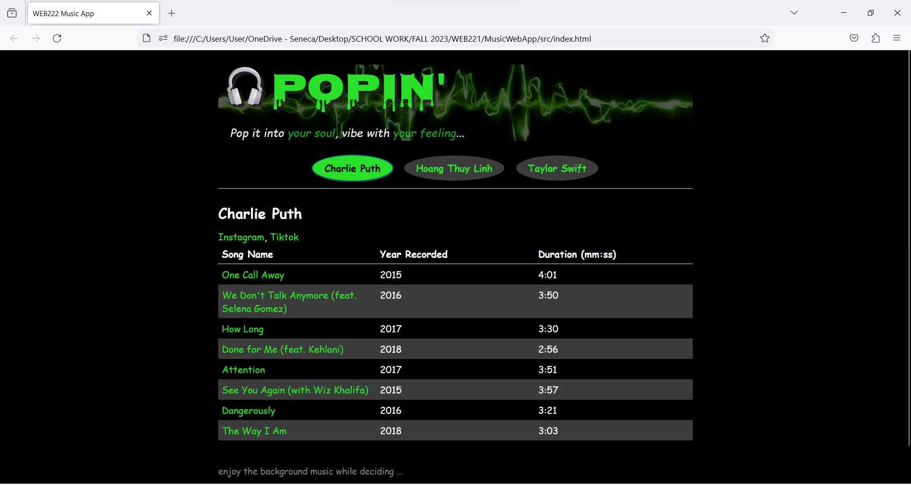

# MusicWebApp
 A school assignment, initial version with a table list of music 
 Language: HTML,CSS,JS
 
Innitial look when visiting, optional for background music, and choices of artist

 
after choosing the artist, table and songs list and its detail will pop up  

 
<i>Ps: Updated version came out soon, with cards of song instead of table</i>
